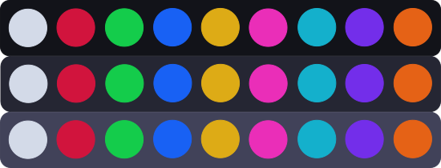

# Entropia Theme
Entropia is a dark colorscheme focused on high contrast, trying to capture the feel of classic terminals with a more modern style

## Color Palette
|---------------|-----------|--------------------|--------------------|---------------------------------------------------|
| Palette       | HEX       | RGB                | HSL                |                                                   |
|---------------|-----------|--------------------|--------------------|---------------------------------------------------|
| background0   | `#090a11` | `rgb(9,10,17)`     | `hsl(232,31%,5%)`  |      |
| background1   | `#13141B` | `rgb(19,20,27)`    | `hsl(231,16%,9%)`  |      |
| accent0       | `#242532` | `rgb(36,37,50)`    | `hsl(236,16%,17%)` |              |
| accent1       | `#404159` | `rgb(64,65,89)`    | `hsl(237,16%,30%)` |              |
| white         | `#D4DAE8` | `rgb(212,218,232)` | `hsl(220,30%,87%)` |                  |
| light-gray    | `#AFB4C0` | `rgb(175,180,192)` | `hsl(222,12%,72%)` |        |
| red           | `#D2143D` | `rgb(210,20,61)`   | `hsl(347,83%,45%)` |                      |
| red-faint     | `#D1526D` | `rgb(209,82,109)`  | `hsl(347,58%,57%)` |          |
| green         | `#14CC4B` | `rgb(20,204,75)`   | `hsl(138,82%,44%)` |                  |
| green-faint   | `#57B272` | `rgb(87,178,114)`  | `hsl(138,37%,52%)` |      |
| blue          | `#1A63F4` | `rgb(26,99,244)`   | `hsl(220,91%,53%)` |                    |
| blue-faint    | `#7BA3F4` | `rgb(123,163,244)` | `hsl(220,85%,72%)` |        |
| yellow        | `#DFAD16` | `rgb(223,173,22)`  | `hsl(45,82%,48%)`  |                |
| yellow-faint  | `#DDC16E` | `rgb(221,193,110)` | `hsl(45,62%,65%)`  |    |
| magenta       | `#EA2EB8` | `rgb(234,46,184)`  | `hsl(316,82%,55%)` |              |
| magenta-faint | `#EA75CB` | `rgb(234,117,203)` | `hsl(316,74%,69%)` |  |
| cyan          | `#14B1CC` | `rgb(20,177,204)`  | `hsl(189,82%,44%)` |                    |
| cyan-faint    | `#51BACD` | `rgb(81,186,205)`  | `hsl(189,55%,56%)` |        |
| purple        | `#6614D2` | `rgb(102,20,210)`  | `hsl(266,83%,45%)` |                |
| purple-faint  | `#8952D1` | `rgb(137,82,209)`  | `hsl(266,58%,57%)` |    |
| orange        | `#E56115` | `rgb(229,97,21)`   | `hsl(22,83%,49%) ` |                |
| orange-faint  | `#E68E5C` | `rgb(230,142,92)`  | `hsl(22,73%,63%) ` |    |
|---------------|-----------|--------------------|--------------------|---------------------------------------------------|

### Extra colors
|--------------------|-----------|-------------------|--------------------|
| Palette            | HEX       | RGB               | HSL                |
|--------------------|-----------|-------------------|--------------------|
| bg-red-intense     | `#990F2D` | `rgb(153,15,45)`  | `hsl(347,82%,33%)` |
| bg-green-intense   | `#0F9939` | `rgb(15,153,57)`  | `hsl(138,82%,33%)` |
| bg-blue-intense    | `#0F3D99` | `rgb(15,61,153)`  | `hsl(220,82%,33%)` |
| bg-yellow-intense  | `#99770F` | `rgb(153,119,15)` | `hsl(45,82%,33%)`  |
| bg-magenta-intense | `#991E79` | `rgb(153,30,121)` | `hsl(316,67%,36%)` |
| bg-cyan-intense    | `#0F8499` | `rgb(15,132,153)` | `hsl(189,82%,33%)` |
| bg-purple-intense  | `#4B0F99` | `rgb(75,15,153)`  | `hsl(266,82%,33%)` |
| bg-orange-intense  | `#99420F` | `rgb(153,66,15)`  | `hsl(22,82%,33%)`  |
|--------------------|-----------|-------------------|--------------------|
| bg-red-subtle      | `#660A1E` | `rgb(102,10,30)`  | `hsl(347,82%,22%)` |
| bg-green-subtle    | `#0A6624` | `rgb(10,102,36)`  | `hsl(137,82%,22%)` |
| bg-blue-subtle     | `#0A2966` | `rgb(10,41,102)`  | `hsl(220,82%,22%)` |
| bg-yellow-subtle   | `#664F0A` | `rgb(102,79,10)`  | `hsl(45,82%,22%)`  |
| bg-magenta-subtle  | `#661450` | `rgb(102,20,80)`  | `hsl(316,67%,24%)` |
| bg-cyan-subtle     | `#0A5866` | `rgb(10,88,102)`  | `hsl(189,82%,22%)` |
| bg-purple-subtle   | `#300A66` | `rgb(48,10,102)`  | `hsl(265,82%,22%)` |
| bg-orange-subtle   | `#662C0A` | `rgb(102,44,10)`  | `hsl(22,82%,22%)`  |
|--------------------|-----------|-------------------|--------------------|
| bg-red-nuanced     | `#33050F` | `rgb(51,5,15)`    | `hsl(347,82%,11%)` |
| bg-green-nuanced   | `#053312` | `rgb(5,51,18)`    | `hsl(137,82%,11%)` |
| bg-blue-nuanced    | `#051433` | `rgb(5,20,51)`    | `hsl(220,82%,11%)` |
| bg-yellow-nuanced  | `#332705` | `rgb(51,39,5)`    | `hsl(44,82%,11%)`  |
| bg-magenta-nuanced | `#330A28` | `rgb(51,10,40)`   | `hsl(316,67%,12%)` |
| bg-cyan-nuanced    | `#052C33` | `rgb(5,44,51)`    | `hsl(189,82%,11%)` |
| bg-purple-nuanced  | `#180533` | `rgb(24,5,51)`    | `hsl(265,82%,11%)` |
| bg-orange-nuanced  | `#331505` | `rgb(51,21,5)`    | `hsl(21,82%,11%)`  |
|--------------------|-----------|-------------------|--------------------|
